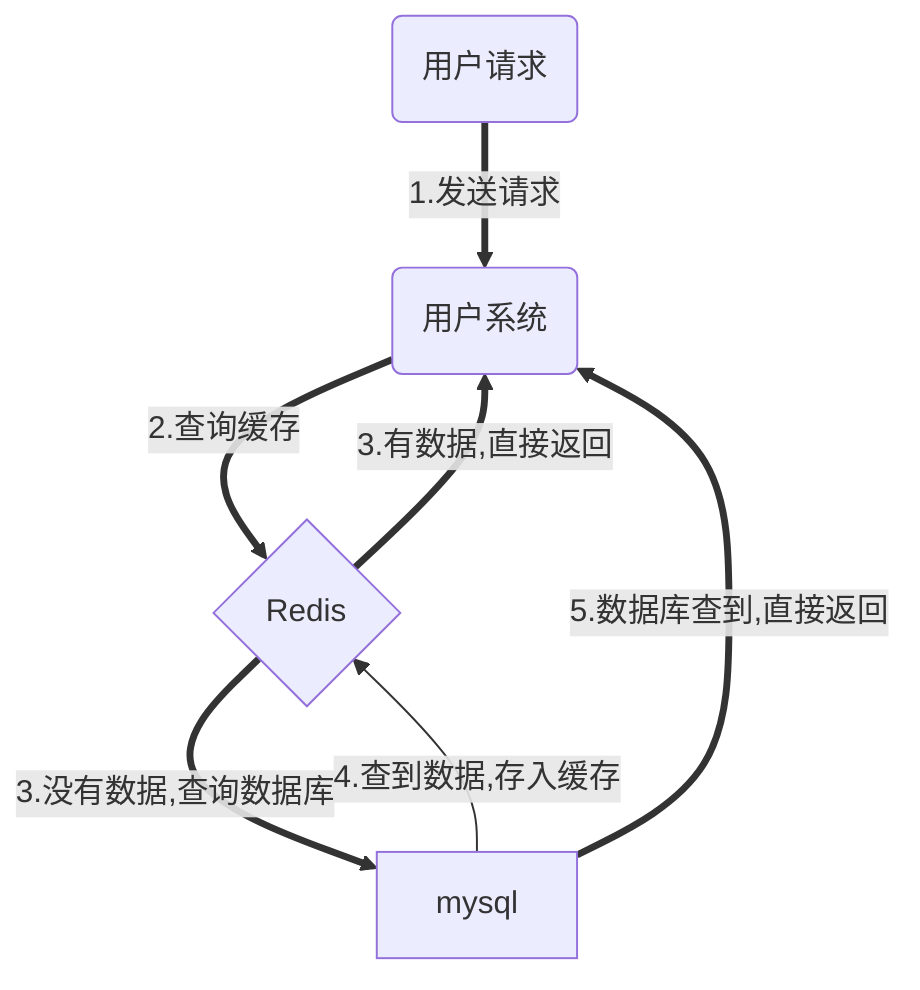

# redis
## 1.简介

- 内存存储的数据结构服务器
- 可用作数据库，高速缓存和消息队列代理
- 支持[字符串]、[哈希表]、[列表]、[集合]、[有序集合]，[位图]，[hyperloglogs]等数据类型
- 内置复制、Lua脚本、LRU收回、事务以及不同级别磁盘持久化功能
- 同时通过Redis Sentinel提供高可用，通过Redis Cluster提供自动分区


## 2.数据结构

### 2.1字符串

### 2.2哈希表

### 2.3列表

### 2.4集合

### 2.5有序集合

### 2.6位图

### 2.7hyperloglogs


## 3.磁盘持久化功能


## 4.高可用

高可用HA（High Availability）是分布式系统架构设计中必须考虑的因素之一，它通常是指，通过设计 ==减少系统不能提供服务的时间== 。

## 5.自动分区


# redis缓存

**缓存雪崩，缓存击穿，缓存穿透**，是使用redis过程中三个比较致命的问题。

在日常开发中一定要注意，每次使用Redis时，都要对其保持严谨的态度。

还有一个需要注意的是要做好**熔断**，一旦出现缓存雪崩，击穿，穿透这种情况，至少还有熔断机制保护数据库不会被打死。


## 1.缓存雪崩

当某一个时刻==出现大规模的缓存失效==的情况，那么就会导致**大量的请求直接打在数据库**上面，导致数据库压力巨大。

如果在高并发的情况下，可能瞬间就会导致数据库宕机。这时候如果运维马上又重启数据库，马上又会有新的流量把数据库打死。这就是缓存雪崩。



缓存雪崩示意图

```flow
start=>start: 用户请求
operation=>operation: 用户系统
condition=>condition: redis
output=>inputoutput: mysql

start->operation->condition->condition(no,bottom)->output
```

【出现缓存雪崩的原因】

- 同一时间大规模的key失效 或者是采用了相同的过期时间。

  > 解决方案：
  >
  > - 在原有的失效时间上加上一个随机值，比如1-5分钟随机。这样就避免了因为采用相同的过期时间导致的缓存雪崩。
  > - 使用熔断机制。当流量到达一定的阈值时，就直接返回“系统拥挤”之类的提示，防止过多的请求打在数据库上。至少能保证一部分用户是可以正常使用，其他用户多刷新几次也能得到结果。
  > - 
  >
  > 

- 可能是Redis宕机

  > 解决方案：为了防止Redis宕机导致缓存雪崩的问题，可以搭建Redis集群，提高Redis的容灾性。

==其他规避方案：==

1. 使用熔断机制。当流量到达一定的阈值时，就直接返回“系统拥挤”之类的提示，防止过多的请求打在数据库上。至少能保证一部分用户是可以正常使用，其他用户多刷新几次也能得到结果。
2. 提高数据库的容灾能力，可以使用分库分表，读写分离的策略。


## 2.缓存击穿

缓存击穿是==一个热点的Key==，有大并发集中对其进行访问，突然间这个Key失效了，导致大并发全部打在数据库上，导致数据库压力剧增。这种现象就叫做缓存击穿

==规避方案：==

1. 可以考虑热点key不设置过期时间（如果业务允许的话）

2. 可以考虑降低打在数据库上的请求数量

   使用互斥锁。如果缓存失效的情况，只有拿到锁才可以查询数据库，降低了在同一时刻打在数据库上的请求，防止数据库打死。当然这样会导致系统的性能变差。


## 3.缓存穿透

我们使用Redis大部分情况都是通过Key查询对应的值，假如==发送的请求传进来的key是不存在Redis中==的，那么就查不到缓存，查不到缓存就会去数据库查询。**假如有大量这样的请求，这些请求像“穿透”了缓存一样直接打在数据库上**，这种现象就叫做缓存穿透。


分析： 对参数做好校验，一些非法的参数，不可能存在的key就直接返回错误提示，要对调用方保持这种“不信任”的心态。

==规避方案：==

1. 把无效的Key存进Redis中。如果Redis查不到数据，数据库也查不到，我们把这个Key值保存进Redis，设置value="null"，当下次再通过这个Key查询时就不需要再查询数据库。

   这种处理方式肯定是有问题的，假如传进来的这个不存在的Key值每次都是随机的，那存进Redis也没有意义。

2. 在缓存之前再加一层布隆过滤器，在查询的时候先去布隆过滤器查询 key 是否存在，如果不存在就直接返回


